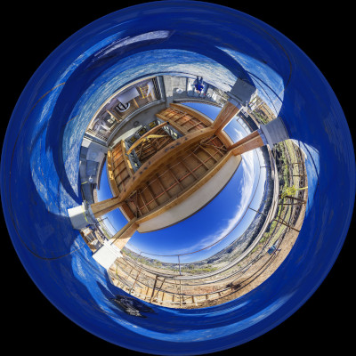
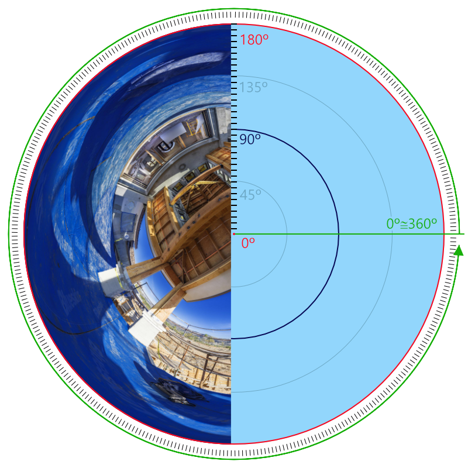
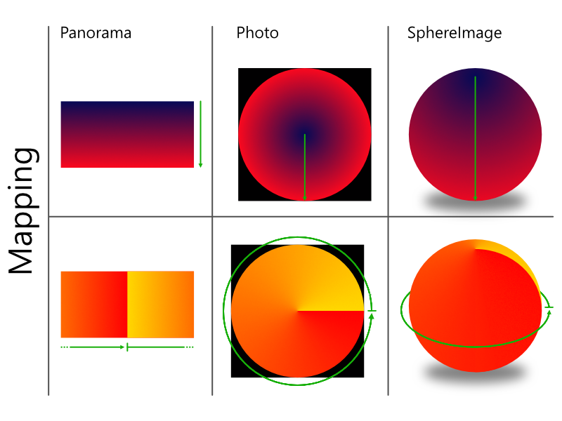

# Photonbend
Photonbend is a python module to handle photos, especially photos taken with fisheye lenses, and convert them between different kinds of lenses, FoV, and types of photos like inscribed circles, cropped circles, or even side-by-side double inscribed circles. It also allows you to rotate those photos, convert them to equirectangular panoramas or convert panoramas to fisheye photos.

It can be used as a library to handle images on your projects or it can be used as a standalone tool with its own set of commands to help you alter your photos taken with a [fisheye lens](https://en.wikipedia.org/wiki/Fisheye_lens), an [omnidirectional camera](https://en.wikipedia.org/wiki/Omnidirectional_(360-degree)_camera) such as the Samsung Gear 360 or an [equirectangular](https://en.wikipedia.org/wiki/Equirectangular_projection) panorama.

If you just want to use the tools go to the [Scripts](docs/scripts.md). If you want to undestand how it works just keep reading

# Concepts
## Fisheye photography
Unlike rectilinear lenses, fisheye lenses can capture great angles like 180º and even greater. With the right setup we can nowadays produce 360º images.

  ***A 360º fisheye photo with its center aiming at the ceiling.***[^1]

Those type of images follow a scheme like the one below:

 
***Fisheye photo scheme depicting the angles produced by an equidistant lens***

## How it works

This module uses the information you provide about the image format, lenses, and FoV, couples it with mathematical functions that describes the ways the lenses behave, and makes use of trigonometry to map your planar photos or panoramas to a sphere (actually, the interior wall of a sphere.
Using a sphere as a base lets you rotate the image. Using all those functions and trigonometry, it also lets you take a virtual picture of the interior of the sphere using different sorts of lenses and FoV to produce new images. It also lets you map a sphere to an equirectangular panorama.

You can see examples on the [scripts page](docs/scripts.md)

## Convention
On the case of the images this software was designed to handle, the convention we adopted was the the center of the image is the top of the sphere, and its borders are the maximum angle of the FoV (In case of a 360 degree image, the sphere's bottom). **This convention is important to understand the rotation scheme**.

## Rotation
This tool lets you rotate your images. For reference, the rotation is defined in 3 degrees of freedom, namely: pitch, yaw and roll, and their direction of rotation are those shown in the image below:

 
***For reference, on the scheme above, we are visualizing the image sphere looking down from its top.***

# Scripts
The module installs a a script 3 different commands to help you deal with your images.
 - [make-photo](docs/scripts.md#make-photo)
 - [alter-photo](docs/scripts.md#alter-photo)
 - [make-pano](docs/scripts.md#make-pano)

[^1]:
    ## About the source image used on the examples:

    Author: Bob Dass  
    Title: View From The Deck  
    Available at: https://flickr.com/photos/54144402@N03/50677156243/in/faves-195024173@N05/  
    License: Creative Commons - Attribution 2.0  
    [License summary here](https://creativecommons.org/licenses/by/2.0/)  
    [License text here](https://creativecommons.org/licenses/by/2.0/legalcode)  