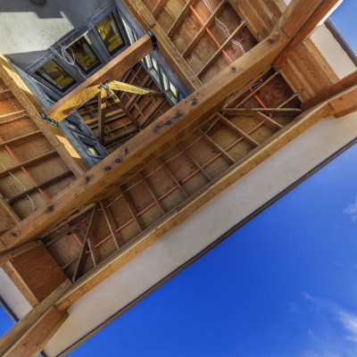

# Photonbend
Photonbend is a python module to handle photos, especially photos taken with fisheye lenses, and convert them between different kinds of lenses, FoV and types of photos like inscribed circles, cropped circles or even side-by-side double inscribed circles. It also allows you to rotate those photos, convert them to equirectangular panoramas or convert panoramas fisheye photos.

It can be used as a library to handle images on your own projects or it can be used as a standalone tool with its own set of commands to help you alter your images

# Scripts
When installing it sets up a script with 3 different commands to help you deal with your images

## make-photo
This tool allows you to make a photo out of a panorama.

### Make a 360 degrees photo with an equidistant lens
The example bellow creates a photo of type `inscribed`, with an `equidistant` lens, and a FoV of `360` degrees named `equidistant.jpg` from the panorama in file `./original/View_From_The_Deck_6k.jpg`

> `photonbend make-photo --type inscribed --lens equidistant --fov 360 ./original/View_From_The_Deck_6k.jpg equidistant.jpg`

## alter-photo
This tool allows you to change your photos by exchanging lenses, FoV, types and rotate your images.

### Change of projection (Lens)
The example bellow changes the photo lenses from `equidistant` projection to `equisolid` projection.

> `photonbend alter-photo --itype inscribed --otype inscribed --ilens equidistant --olens equisolid --ifov 360 --ofov 360 equidistant.jpg equisolid.jpg`

### Change of FoV
The example bellow changes the photo `equidistant.jpg`. Its FoV from `360` degrees to `180`, producing the image `equidistant-180.jpg`.

> `photonbend alter-photo --itype inscribed --otype inscribed --ilens equidistant --olens equidistant --ifov 360 --ofov 180 equidistant.jpg equidistant-180.jpg` 

**Notice there is no more data about half of view of the original image on the modified one (Can't see the floor anymore).**

### Change of type
The example bellow changes the photo `equidistant.jpg`. Its type from `inscribed` to `double`, producing `equidistant-double.jpg`.

**Note**: Notice we also have to **change the FoV** when producing a **double inscribed** image. That happens because the double inscribed image uses two inscribed images side by side on a single image file. It is meant to be used with full 360 degrees images, but its FoV describes the maximum FoV of each of its inscribed image.

> `photonbend alter-photo --itype inscribed --otype double --ilens equidistant --olens equidistant --ifov 360 --ofov 195 equidistant.jpg equidistant-double.jpg` 

### Change of type, lens and FoV
The example bellow changes the photo `equidistant.jpg` from type `inscribed` to `full`, its lenses from `equidistant` to `rectilinear` and its FoV from `360` degrees to `140`, producing the image `rectlinear-full.jpg`.

> `photonbend alter-photo --itype inscribed --otype full --ilens equidistant --olens rectilinear --ifov 360 --ofov 140 equidistant.jpg rectlinear-full.jpg` 

### Rotation
The example bellow changes the photo `equidistant.jpg`, rotating it `-90` degrees in pitch, `0` degrees in yaw and `0` degrees in roll, producion `equidistant-rotated.jpg`.

> `photonbend alter-photo --itype inscribed --otype inscribed --ilens equidistant --olens equidistant --ifov 360 --ofov 360 --rotation -90 0 0 equidistant.jpg equidistant-rotated.jpg` 

### Combining it all
The example bellow changes the photo `equidistant.jpg` from type `inscribed` to `full`, its lenses from `equidistant` to `rectilinear` and its FoV from `360` degrees to `140`. It is also rotated by `-90` degrees in pitch, `195` degrees in yaw and `0` degrees in roll producing the image `rectlinear-140-full-rotated.jpg`.

> `photonbend alter-photo --itype inscribed --otype full --ilens equidistant --olens rectilinear --ifov 360 --ofov 140 --rotation -90 195 0 equidistant.jpg rectlinear-140-full-rotated.jpg` 

## make-pano
This tool allows you to change create panoramas out of your photos

### Make a panorama
Make a panorama out of an `inscribed`, `equidistant` lens, `360` degrees FoV photo named `equidistant.jpg`, producing `panorama.jpg`.

> `photonbend make-pano --type inscribed --lens equidistant --fov 360 equidistant.jpg panorama.jpg`

### Make a rotated panorama
Make a panorama out of an `inscribed`, `equidistant` lens, `360` degrees FoV photo named `equidistant.jpg`, producing `panorama_rotated.jpg`.
> `photonbend make-pano --type inscribed --lens equidistant --fov 360 --rotation -90 90 0 equidistant.jpg panorama.jpg`

## About the source image used on this example:

Author: Bob Dass  
Title: View From The Deck  
Available at: https://flickr.com/photos/54144402@N03/50677156243/in/faves-195024173@N05/  
License: Creative Commons - Attribution 2.0  
[License summary here](https://creativecommons.org/licenses/by/2.0/)  
[License text here](https://creativecommons.org/licenses/by/2.0/legalcode)  