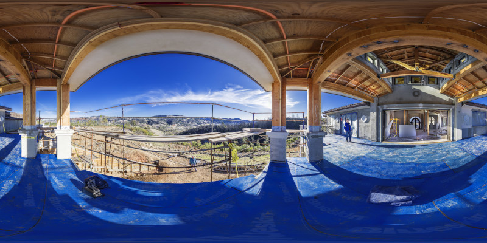
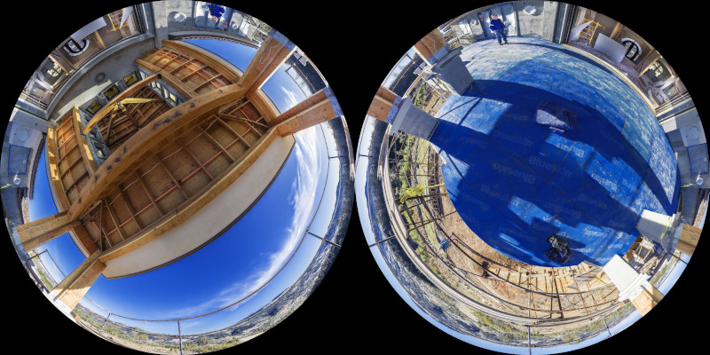
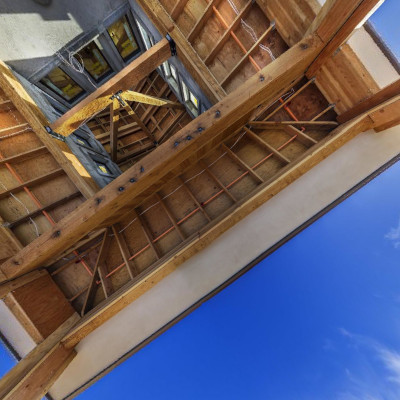
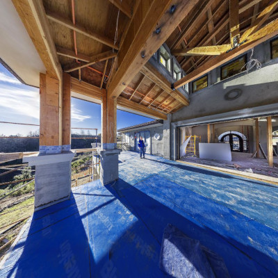
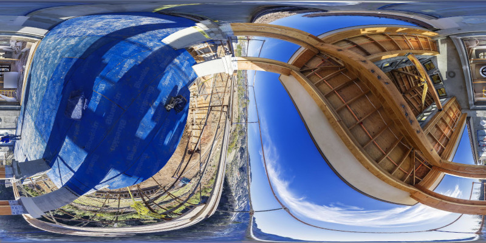

# Scripts
When photonbend is installed, it sets up a script with 3 different commands to help you deal with your images.
 - [make-photo](#make-photo)
 - [alter-photo](#alter-photo)
 - [make-pano](#make-pano)

## make-photo
This tool allows you to make a photo out of an equirectangular panorama (2:1 aspect ration).

### Make a 360 degrees photo with an equidistant lens
The example below creates a photo of type `inscribed`, with an `equidistant` lens, and an FoV of `360` degrees named `equidistant.jpg` from the panorama in file `./original/View_From_The_Deck_6k.jpg`[^1]

```
photonbend make-photo --type inscribed --lens equidistant --fov 360 ./original/View_From_The_Deck_6k.jpg equidistant.jpg
```

[](/examples/original/View_From_The_Deck_6k.jpg)
[](/examples/equidistant.jpg)

## alter-photo
This tool allows you to change your photos by exchanging lenses, FoV, and types as well as rotate your images.

### Change of projection (Lens)
The example below changes the photo lenses from `equidistant` projection to `equisolid` projection.

```
photonbend alter-photo --itype inscribed --otype inscribed --ilens equidistant --olens equisolid --ifov 360 --ofov 360 equidistant.jpg equisolid.jpg
```

[](/examples/equidistant.jpg)
[](/examples/equisolid.jpg)

### Change of FoV
The example below changes the photo `equidistant.jpg`. Its FoV is altered from `360` degrees to `180`, producing the image `equidistant-180.jpg`.

```
photonbend alter-photo --itype inscribed --otype inscribed --ilens equidistant --olens equidistant --ifov 360 --ofov 180 equidistant.jpg equidistant-180.jpg
```

[](/examples/equidistant.jpg)
[](/examples/equidistant-180.jpg)

**Notice there is no more data about half of the view of the original image on the modified one (Can't see the floor anymore).**

### Change of type
The example below changes the photo `equidistant.jpg`. Its type from `inscribed` to `double`, producing `equidistant-double.jpg`.

**Note**: When producing a **double inscribed** image, we **nominally** also have to **change the FoV**. That happens because the double inscribed image uses two inscribed images side by side on a single image file. It is meant to be used with full 360 degrees images, but its FoV describes the maximum FoV of each of its two inscribed images.

```
photonbend alter-photo --itype inscribed --otype double --ilens equidistant --olens equidistant --ifov 360 --ofov 195 equidistant.jpg equidistant-double.jpg
```

[](/examples/equidistant.jpg)
[](/examples/equidistant-double.jpg)


### Change of type, lens, and FoV
The example below changes the photo `equidistant.jpg` from type `inscribed` to `full`, its lenses from `equidistant` to `rectilinear`, and its FoV from `360` degrees to `140`, producing the image `rectlinear-full.jpg`.

```
photonbend alter-photo --itype inscribed --otype full --ilens equidistant --olens rectilinear --ifov 360 --ofov 140 equidistant.jpg rectlinear-full.jpg
```

[](/examples/equidistant.jpg)
[](/examples/rectlinear-full.jpg)


### Rotation
The example below changes the photo `equidistant.jpg`, rotating it `-90` degrees in pitch, `0` degrees in yaw, and `0` degrees in roll, producing `equidistant-rotated.jpg`.

```
photonbend alter-photo --itype inscribed --otype inscribed --ilens equidistant --olens equidistant --ifov 360 --ofov 360 --rotation -90 0 0 equidistant.jpg equidistant-rotated.jpg
```

[](/examples/equidistant.jpg)
[](/examples/equidistant-rotated.jpg)

### Combining it all
The example below changes the photo `equidistant.jpg` from type `inscribed` to `full`, its lenses from `equidistant` to `rectilinear`, and its FoV from `360` degrees to `140`. It is also rotated by `-90` degrees in pitch, `195` degrees in yaw and `0` degrees in roll producing the image `rectlinear-140-full-rotated.jpg`.

```
photonbend alter-photo --itype inscribed --otype full --ilens equidistant --olens rectilinear --ifov 360 --ofov 140 --rotation -90 0 195 equidistant.jpg rectlinear-140-full-rotated.jpg
```

[](/examples/equidistant.jpg)
[](/examples/rectlinear-140-full-rotated.jpg)

## make-pano
This tool allows you to change create panoramas out of your photos

### Make a panorama
Make a panorama out of an `inscribed`, `equidistant` lens, `360` degrees FoV photo named `equidistant.jpg`, producing `panorama.jpg`.

```
photonbend make-pano --type inscribed --lens equidistant --fov 360 equidistant.jpg panorama.jpg
```

[](/examples/panorama.jpg)


### Make a rotated panorama
Make a panorama out of an `inscribed`, `equidistant` lens, `360` degrees FoV photo named `equidistant.jpg`, producing `panorama_rotated.jpg`.

```
photonbend make-pano --type inscribed --lens equidistant --fov 360 --rotation -90 0 90 equidistant.jpg panorama.jpg
```

[](/examples/panorama-rotated.jpg)

[^1]:
    ### About the source image used on the examples:
    Author: Bob Dass <br>
    Title: View From The Deck <br>
    Available at: https://flickr.com/photos/54144402@N03/50677156243/in/faves-195024173@N05/ <br>
    License: Creative Commons - Attribution 2.0 <br>
    [License summary here](https://creativecommons.org/licenses/by/2.0/) <br>
    [License text here](https://creativecommons.org/licenses/by/2.0/legalcode) <br>